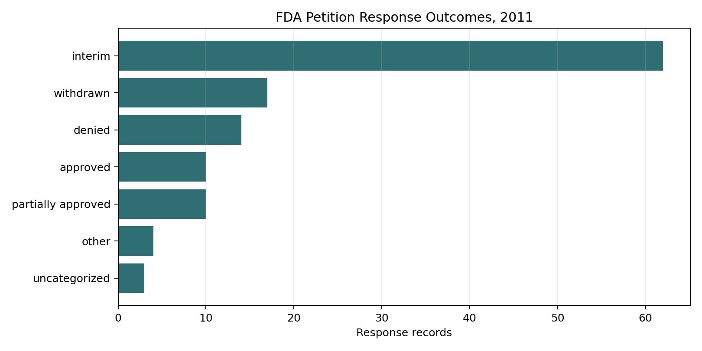
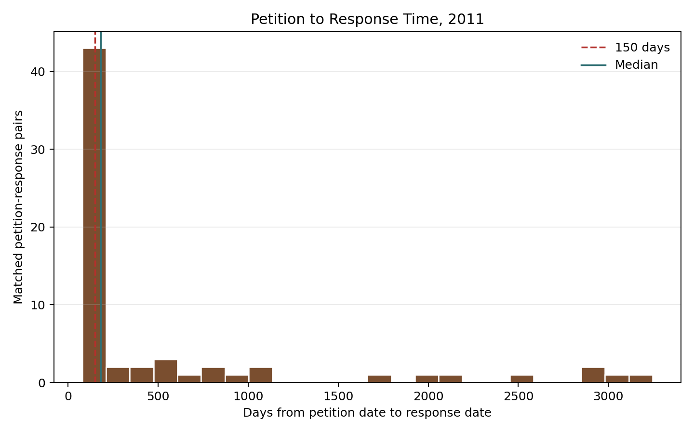

# From Public Petitions to Structured Evidence: An NLP-Assisted Analysis of FDA Citizen Petition Responses in 2011

**Kyaw Min (Harry) Khant**  
Research completed under the supervision of Allison Schmitt, aaschmit@uoregon.edu  
May 2026

## Abstract

Citizen petitions allow individuals, firms, and organizations to ask the U.S. Food and Drug Administration (FDA) to issue, amend, revoke, or refrain from taking administrative action. The process is designed as a public participation mechanism, but prior research has also connected petitions to regulatory delay, especially in generic drug approval contexts. This paper analyzes a 2011 FDA citizen petition dataset created from public PDF records after the completion of a document extraction and validation workflow. Using a pipeline that combines PDF parsing, OCR fallback logic, and local large language model extraction, I structured petition and response documents into analyzable fields, including petitioner identity, requested action, responding FDA center, response outcome, cited authorities, and response dates. The resulting dataset contains 652 raw document metadata records, 129 validated petition rows, and 120 validated response rows. Matching petitions and responses by docket ID produced 87 petition-response row pairs; after excluding negative date intervals, 64 valid pair-level records remained across 41 docket IDs. The most common response category was interim response, and the median petition-to-response time among valid pair-level matches was 182.5 days. The analysis shows how careful data preparation, transparent validation, and accessible visualization can turn a messy public document archive into evidence that supports policy-facing research.

## Introduction

Public agencies often make important decisions through document-heavy processes. These documents are public, but they are not always easy to analyze. FDA citizen petitions are a useful example: the petition process creates a public record of requests, interim responses, final responses, withdrawals, and supporting materials, yet the information is scattered across PDFs, docket identifiers, and agency correspondence. For researchers, this creates a familiar data problem. The evidence exists, but it must be collected, cleaned, validated, and organized before it can support reliable analysis.

This project asks a practical research question: **How can NLP-assisted document extraction and structured analysis help characterize FDA citizen petitions, including who filed petitions, what actions they requested, how the FDA responded, and how long responses took?**

The question matters because citizen petitions are both democratic and administrative. They allow outside parties to put issues before FDA, but they also require agency attention and may affect the timing of other regulatory decisions. The project therefore combines two kinds of work. First, it builds a reproducible data workflow from public PDFs. Second, it interprets the resulting dataset in light of existing scholarship on citizen petitions, regulatory capacity, and possible delay.

## Policy and Literature Background

Under 21 CFR 10.30, an interested person may petition FDA to issue, amend, or revoke a regulation or order, or to take or refrain from taking another form of administrative action. The regulation requires FDA to respond to each petitioner within 180 days unless another provision applies. A response may approve the petition, deny it, dismiss it, provide a tentative response, or take another appropriate action. Section 505(q) creates a more specific framework for certain petitions that relate to pending abbreviated drug, biosimilar, or 505(b)(2) applications; FDA guidance and annual reports describe a 150-day final-action deadline for petitions subject to that provision.

The literature suggests that the petition system has two faces. On one hand, it is an accountability tool that allows stakeholders to bring scientific, legal, and policy concerns to the agency. On the other hand, it has raised concerns about timeliness and strategic behavior. A 1998 HHS Office of Inspector General review found that FDA did not have an effective process for handling citizen petitions in a timely manner and identified a backlog of about 250 unresolved petitions, some dating to the 1970s and early 1980s. That finding frames timeliness not simply as an operational issue, but as a transparency and trust issue.

Later empirical studies focused heavily on the pharmaceutical context. Carrier and Wander reviewed citizen petitions filed between 2001 and 2010 and found that brand-name drug companies filed a large share of petitions, many of them targeting generic drugs. They also reported a low overall grant rate, suggesting that many petitions did not ultimately persuade FDA on the merits. Carrier and Minniti later studied 505(q) petitions from 2011 to 2015, emphasizing late-filed petitions and the relationship between petition timing and generic competition. Fahim and Ngorsuraches compared abbreviated new drug applications (ANDAs) with and without citizen petitions and found that ANDAs associated with petitions had significantly longer approval times.

This project does not claim that all 2011 petitions caused delay. The dataset is broader than confirmed 505(q) petitions, and pair-level document matching is not the same as causal identification. Instead, the project contributes a data infrastructure layer: it shows how one year of FDA petition records can be converted into structured evidence that can later support richer descriptive, comparative, or survival-modeling work.

## Data and Methods

The dataset was built from public FDA citizen petition PDFs for 2011. The raw inventory contains 652 document metadata records across 156 docket IDs. These records include petitions, responses or decisions, supplements, amendments, comments, and other related docket materials. Because the raw documents were unevenly structured, the workflow separated extraction from validation.

The extraction pipeline used:

1. PDF text extraction with PyMuPDF, pdfplumber, and PyPDF2.
2. OCR fallback using pytesseract and pdf2image for difficult scanned documents.
3. A local Ollama model to return structured fields in JSON format.
4. Rule-based normalization for docket IDs, response categories, FDA centers, and response timing.
5. Manual/automated validation flags to identify complete rows, mostly complete rows, incomplete rows, PDF read errors, and missing files.

The validated petition table contains 129 rows across 96 docket IDs. The validated response table contains 120 rows across 87 docket IDs. Key fields include file name, date, petitioner or responding center, requested action, response outcome, cited statutes or regulations, and justification text. Petition and response records were matched using docket IDs extracted from filenames with a regular expression matching the pattern `FDA-YYYY-P-NNNN`.

For response-time analysis, I computed the difference between `Date of Response` and `Date of Petition`. Negative intervals were excluded because they usually indicate either a non-final document sequence, extraction error, or mismatch between a petition-related document and the relevant response. This produced 64 nonnegative pair-level matches across 41 docket IDs.

## Findings

### FDA responses were often interim rather than final

The most common normalized response category in the validated response table was **interim response**, accounting for 62 of 120 response rows. Other outcomes included withdrawal, denial, partial approval, approval, other, and uncategorized records. This distribution is important because it shows that a response in the docket record is not always a final resolution. In practical terms, a docket can appear "answered" while substantive review remains open.

### CDER dominated the response records

The Center for Drug Evaluation and Research (CDER) appeared most frequently among named responding FDA centers, with 64 response rows. The Center for Devices and Radiological Health (CDRH) and the Center for Food Safety and Applied Nutrition (CFSAN) were the next most common named centers. Twenty-two response rows did not mention a responding center. This center distribution is consistent with the literature's attention to drug-related petitions, although the 2011 dataset also includes devices, food, cosmetics, tobacco, and other topics.

### Response timing had a long right tail

Among the 64 nonnegative pair-level matches, the median response time was 182.5 days and the mean response time was 562.5 days. The distance between the median and mean suggests a long right tail: many responses cluster around several months, while some docket sequences extend across years. Only 3 valid pair-level matches fell within 150 days, while 43 fell within 200 days.

These timing results should be interpreted carefully. The analysis is pair-level, not fully docket-level; dockets with multiple petition or response documents can appear more than once. The 150-day benchmark also applies specifically to petitions subject to Section 505(q), not necessarily every citizen petition in the dataset. Still, the response-time distribution helps identify where manual audit and docket-level modeling would be most useful.

## Discussion

The data support three broad conclusions. First, document preparation is not a minor technical detail; it is central to the research. Without docket extraction, validation flags, and response-category normalization, the public FDA archive is difficult to summarize accurately. Second, interim responses are not noise. They are a major feature of the administrative record and should be treated as analytically distinct from final approvals or denials. Third, the 2011 data fit the broader literature's concern with timeliness, but they also show why causal claims require caution. A long response time may reflect strategic filing, complex scientific review, incomplete records, supplements, amendments, or agency workload.

The project also shows the value of transparent data documentation. A reader can see what was extracted, what was validated, which rows have quality issues, and how response-time metrics were computed. This matters for public data work beyond FDA petitions. Whether working with regulatory dockets, Census tables, survey files, or demographic datasets, the same principle applies: responsible analysis depends on making the data preparation process legible.

## Limitations

This analysis has several limitations. The validated response table includes PDF read errors and incomplete records, so outcome counts may change after further manual review. The response matching is based on docket IDs and dates rather than a fully curated docket chronology. The response categories are rule-based and should be audited before publication. Finally, the dataset does not separately identify which records are legally subject to Section 505(q), so the 150-day benchmark is used only as contextual reference, not as a compliance finding.

## Conclusion

This project demonstrates an end-to-end public data workflow: collecting messy government documents, extracting structured fields, validating data quality, generating visual summaries, and interpreting findings through existing literature. The substantive finding is cautious but useful: in the 2011 FDA citizen petition records analyzed here, interim responses were common and response timing varied substantially. The methodological contribution is broader. Public documents can become usable evidence when researchers combine data engineering, NLP, validation, visualization, and careful writing.

## References

Carrier, M. A., & Minniti, C. (2016). *Citizen petitions: Long, late-filed, and at-last denied*. American University Law Review, 66(2), 305-362. https://digitalcommons.wcl.american.edu/aulr/vol66/iss2/1/

Carrier, M. A., & Wander, D. (2012). *Citizen petitions: An empirical study*. Cardozo Law Review, 34(1), 249-293. https://larc.cardozo.yu.edu/clr/vol34/iss1/7/

Fahim, S. M., & Ngorsuraches, S. (2020). Did citizen petitions prolong the number of approval days of generic drugs? *Research in Social and Administrative Pharmacy, 16*(9), 1282-1284. https://doi.org/10.1016/j.sapharm.2019.12.015

U.S. Food and Drug Administration. (2024). *Sixteenth annual report on delays in approvals of applications related to citizen petitions and petitions for stay of agency action for fiscal year 2023*. https://www.fda.gov/media/184951/download

U.S. Department of Health and Human Services, Office of Inspector General. (1998). *Review of the Food and Drug Administration's citizen petition process*. https://oig.hhs.gov/reports/all/1998/review-of-the-food-and-drug-administrations-citizen-petition-process/

U.S. Government. (n.d.). *21 CFR 10.30: Citizen petition*. Electronic Code of Federal Regulations. https://www.law.cornell.edu/cfr/text/21/10.30
